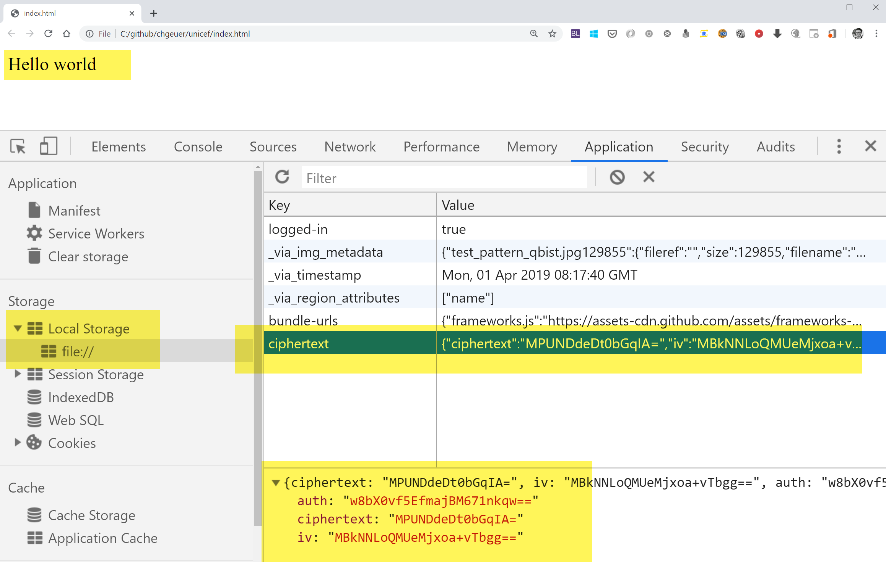

# Simple demo for encrypting local storage, based on a password

## Install build tools

```bash
yarn install
webpack ./app.js
```

## What the code does

- Wrap
  - Derive a cryptograhic key from a password using `pbkdf2`
  - Encrypt data using AES 256 (in GCM mode)
  - Store IV, authN code and ciphertext as stringified JSON in local storage
- Unwrap
  - Derive a cryptograhic key from a password using `pbkdf2`
  - Fetch data from local storage
  - Decrypt
  - Show


